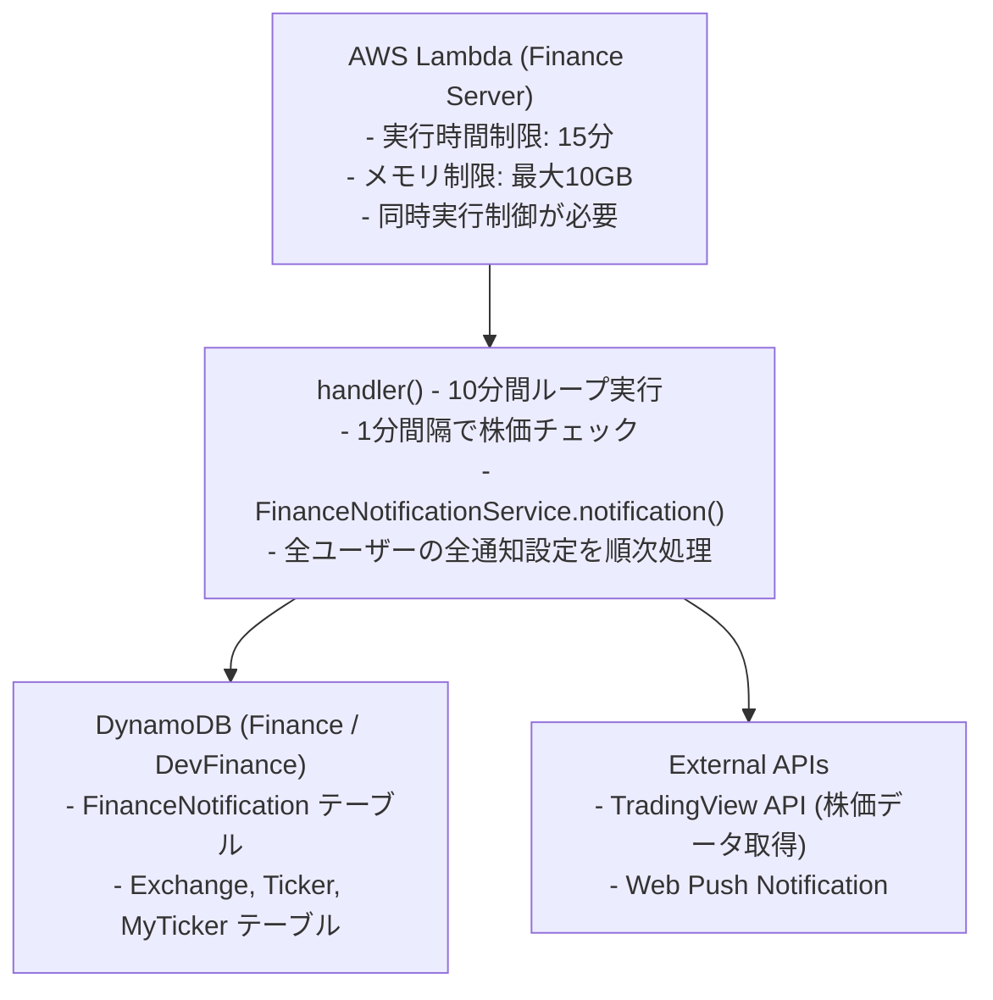
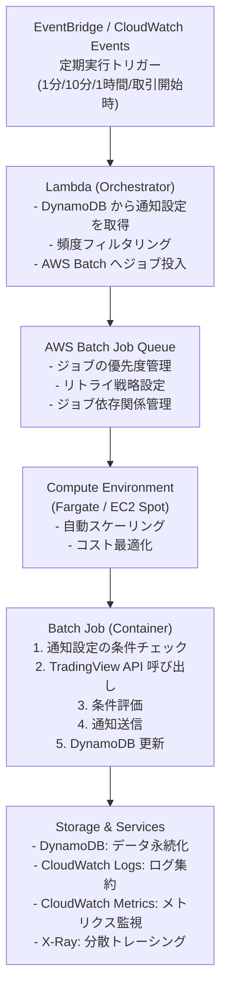
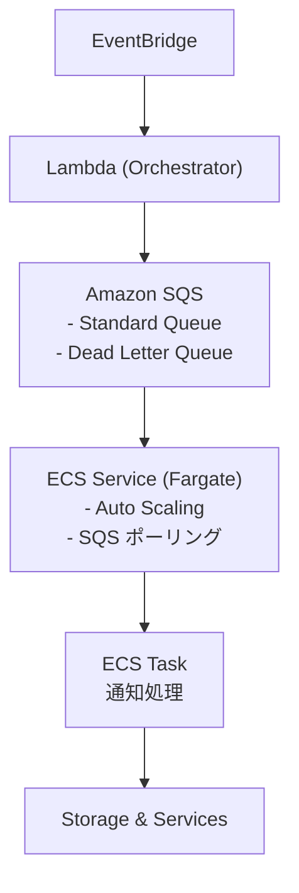

# バッチ処理リファクタリング要件定義

## 概要

現行のバッチ処理システムをより堅牢でスケーラブルなアーキテクチャに移行するための要件定義書です。AWS Lambda の制約を克服し、AWS Batch、SQS、ECS を活用した処理負荷に強い構成を実現します。

## 現状分析

### 現在のアーキテクチャ



### 現状の課題

#### 1. Lambda の実行時間制限

- **問題**: Lambda の最大実行時間は15分
- **影響**: 
    - ユーザー数や通知設定数が増加すると処理が完了しない
    - 現在は10分間で処理を完了させる設計だが、スケールしにくい
    - 処理途中で打ち切られるリスク

#### 2. メモリとコンピューティング制限

- **問題**: Lambda のメモリは最大10GB、CPU はメモリに比例
- **影響**:
    - 大量の株価データを同時処理できない
    - TradingView API 呼び出しが多い場合、並列処理が制限される
    - メモリ不足でクラッシュのリスク

#### 3. スケーラビリティの問題

- **問題**: モノリシックな処理フロー
- **影響**:
    - 全ユーザーの通知設定を1つの Lambda で順次処理
    - 特定ユーザーの処理が遅延すると全体に影響
    - 並列化が困難

#### 4. エラーハンドリングとリトライ

- **問題**: エラー時の再試行メカニズムが限定的
- **影響**:
    - 一時的な API エラーで通知が失敗
    - 部分的な失敗でも全体を再実行する必要
    - エラー追跡が困難

#### 5. コスト効率

- **問題**: 常に同じリソースを割り当て
- **影響**:
    - 軽い処理でも高スペック Lambda を使用
    - アイドル時間のコストが無駄
    - ピーク時の同時実行制限

#### 6. 監視と運用

- **問題**: 処理の可視化が限定的
- **影響**:
    - どのユーザーの処理で時間がかかっているか不明
    - ボトルネックの特定が困難
    - デバッグに時間がかかる

### 現在のバッチ処理フロー

```typescript
// server/finance/index.ts の主要処理フロー
export const handler = async () => {
  // 1. 初期化
  const financeNotificationService = new FinanceNotificationService(...);
  const notificationEndpoint = await getEndpoint();
  
  // 2. 10分間のループ処理
  const endTime = Date.now() + 10 * 60 * 1000;
  while (Date.now() < endTime) {
    // 3. 全通知設定を処理
    await financeNotificationService.notification(notificationEndpoint);
    
    // 4. 1分待機
    await sleep(60 * 1000);
  }
};
```

**処理内容:**
1. DynamoDB から全通知設定を取得 (Scan)
2. 各通知設定について:
   - 頻度チェック (1分毎/10分毎/1時間毎/取引開始時)
   - 該当する場合、条件チェック実行
   - TradingView API で株価データ取得
   - 条件評価 (価格条件、パターン条件など)
   - 条件達成時、Web Push 通知送信
3. 全設定の処理完了後、次のサイクルまで待機

## 目標アーキテクチャ

### 推奨アーキテクチャ: AWS Batch 中心の設計



#### アーキテクチャの特徴

**AWS Batch を選択する理由:**

1.  **ジョブ管理機能が豊富**
    -   優先度ベースのジョブスケジューリング
    -   ジョブ依存関係の定義が可能
    -   リトライ戦略をジョブ定義で設定
    -   ジョブステータスの追跡が容易

2.  **コスト最適化**
    -   EC2 Spot インスタンスの活用で最大90%コスト削減
    -   Fargate Spot で約70%コスト削減
    -   使用したリソース分のみ課金
    -   アイドル時のコストゼロ

3.  **スケーラビリティ**
    -   ジョブ数に応じた自動スケーリング
    -   最大vCPU数の設定による制御
    -   大量ジョブの効率的な処理

4.  **バッチ処理に最適化**
    -   バッチワークロード専用の設計
    -   ジョブの優先度管理
    -   長時間実行ジョブのサポート

**SQS の利用は任意:**

-   AWS Batch は独自のジョブキューを持つため、SQS は必須ではない
-   ただし、以下の場合に SQS の追加を検討:
    -   より細かいメッセージング制御が必要な場合
    -   既存の SQS ベースシステムとの統合が必要な場合
    -   メッセージの永続化や遅延配信が必要な場合

### 代替アーキテクチャ: ECS + SQS (オプション)

SQS を利用したより細かい制御が必要な場合のアーキテクチャです。



**ECS + SQS を選択する場合:**

-   より細かいメッセージング制御が必要
-   リアルタイム性を重視
-   SQS の高度な機能 (遅延配信、メッセージグループ化) が必要

**デメリット:**

-   ジョブ管理機能が AWS Batch より少ない
-   リトライ戦略を自前で実装
-   ジョブの優先度管理が難しい

## 詳細要件

### 機能要件

#### FR-1: ジョブ分散処理

-   **要件**: 通知設定単位でジョブを分割し、並列処理を実現する
-   **詳細**:
    -   各通知設定 (FinanceNotification レコード) を独立したジョブとして処理
    -   AWS Batch Job Queue にジョブを投入
    -   各ジョブが並列実行される
-   **受入基準**:
    -   100件の通知設定を複数ジョブで並列処理できる
    -   1つの通知設定の障害が他に波及しない

#### FR-2: 頻度ベースのフィルタリング

-   **要件**: 通知頻度設定に基づいて処理対象をフィルタリングする
-   **詳細**:
    -   Orchestrator Lambda で頻度チェックを実施
    -   条件を満たす通知設定のみ AWS Batch へジョブ投入
    -   頻度タイプ: 1分毎、10分毎、1時間毎、取引開始時
-   **受入基準**:
    -   各頻度設定で正しくフィルタリングされる
    -   不要な処理が実行されない

#### FR-3: エラーハンドリングとリトライ

-   **要件**: 一時的なエラーに対して自動リトライを行う
-   **詳細**:
    -   AWS Batch のリトライ戦略を活用
    -   最大リトライ回数: 3回
    -   リトライ間隔: exponential backoff (初回30秒、以降2倍)
    -   失敗したジョブは CloudWatch Logs に記録
-   **受入基準**:
    -   TradingView API の一時的エラーで3回リトライされる
    -   3回失敗後、失敗としてマークされる
    -   失敗ジョブがアラート通知される

#### FR-4: 条件チェックと通知送信

-   **要件**: 既存の条件チェックロジックを維持する
-   **詳細**:
    -   FinanceNotificationService の既存ロジックを流用
    -   価格条件、パターン条件のチェック
    -   条件達成時の Web Push 通知送信
    -   最終通知時刻の更新
- **受入基準**:
    - 既存機能と同等の条件チェックが動作
    - 通知送信成功率 > 99%

#### FR-5: ログとトレーシング

- **要件**: 処理の可視化とデバッグを容易にする
- **詳細**:
    - CloudWatch Logs への構造化ログ出力
    - X-Ray による分散トレーシング
    - 各処理のレイテンシ計測
    - エラー発生時の詳細なコンテキスト記録
- **受入基準**:
    - CloudWatch Insights でジョブ検索可能
    - X-Ray でエンドツーエンドのトレース確認可能

### 非機能要件

#### NFR-1: スケーラビリティ

-   **目標**: 通知設定数の増加に線形スケール
-   **指標**:
    -   1,000件の通知設定を5分以内に処理完了
    -   10,000件の通知設定を15分以内に処理完了
    -   並列ジョブ数の増加で処理時間が短縮
-   **スケーリング戦略**:
    -   AWS Batch の Job Queue 深さに基づく Auto Scaling
    -   CPU 使用率 70% でスケールアウト
    -   最小インスタンス数: 0、最大インスタンス数: 20

#### NFR-2: 可用性

-   **目標**: 99.9% のアップタイム
-   **指標**:
    -   サービス停止時間 < 43分/月
    -   通知処理の成功率 > 99.5%
-   **戦略**:
    -   マルチ AZ 配置
    -   AWS Batch ジョブのヘルスチェック
    -   自動復旧メカニズム

#### NFR-3: パフォーマンス

- **目標**: 低レイテンシでの通知処理
- **指標**:
    - 1通知設定の処理時間 < 5秒 (P95)
    - TradingView API 呼び出し時間 < 2秒 (P95)
    - 通知送信時間 < 1秒 (P95)
- **最適化**:
    - API レスポンスのキャッシング検討
    - 並列 API 呼び出し
    - コネクションプーリング

#### NFR-4: コスト効率

- **目標**: 現行 Lambda コストと同等または削減
- **指標**:
    - 月額コスト < Lambda の 1.2倍
    - アイドル時のコスト最小化
- **戦略**:
    - Fargate Spot の活用 (70% コスト削減)
    - 適切な CPU/メモリ割り当て
    - 不要な処理の排除

#### NFR-5: 監視と運用性

- **目標**: 問題の早期検知と迅速な対応
- **指標**:
    - 障害検知 < 5分
    - DLQ メッセージのアラート通知
    - ダッシュボードでのリアルタイム可視化
- **ツール**:
    - CloudWatch Alarms
    - CloudWatch Dashboards
    - SNS 通知

### セキュリティ要件

#### SEC-1: 認証と認可

- **要件**: AWS サービス間の安全な通信
- **詳細**:
    - IAM ロールベースのアクセス制御
    - 最小権限の原則
    - サービス間の VPC エンドポイント使用

#### SEC-2: データ保護

- **要件**: 機密情報の安全な管理
- **詳細**:
    - Secrets Manager による認証情報管理
    - SQS メッセージの暗号化
    - CloudWatch Logs の暗号化

#### SEC-3: ネットワークセキュリティ

-   **要件**: セキュアなネットワーク構成
-   **詳細**:
    -   AWS Batch ジョブの VPC 配置
    -   セキュリティグループによるアクセス制限
    -   NAT Gateway 経由の外部 API アクセス

## データモデル

### AWS Batch ジョブパラメータ

AWS Batch ジョブに渡すパラメータのフォーマット:

```json
{
    "notificationId": "user123#AAPL-NYSE#SansenAkenomyojo",
    "userId": "user123",
    "exchangeId": "NYSE",
    "tickerId": "AAPL-NYSE",
    "conditionType": "SansenAkenomyojo",
    "frequency": "MINUTE_LEVEL",
    "timeframe": "5",
    "session": "extended",
    "targetPrice": null,
    "timestamp": "2024-10-29T23:00:00Z"
}
```

### DynamoDB スキーマ (既存維持)

**FinanceNotification テーブル:**
-   PK: `userId#tickerId#conditionType` (例: `user123#AAPL-NYSE#SansenAkenomyojo`)
-   Attributes:
    -   `conditionType`: 条件タイプ
    -   `frequency`: 通知頻度
    -   `timeframe`: 時間枠
    -   `targetPrice`: 目標価格
    -   `lastNotifiedAt`: 最終通知日時
    -   `createdAt`, `updatedAt`

**処理状態の追跡 (新規追加検討):**
-   テーブル: `FinanceJobStatus`
-   PK: `jobId` (通知ID + タイムスタンプ)
-   Attributes:
    -   `status`: PENDING / PROCESSING / COMPLETED / FAILED
    -   `startedAt`, `completedAt`
    -   `errorMessage`
    -   `retryCount`

## 実装計画

### フェーズ1: 基盤構築 (2-3週間)

#### Week 1: インフラ構築

**タスク:**
1.  AWS Batch 環境の構築
    -   Job Queue の作成
    -   Compute Environment の作成 (EC2 Spot)
    -   Job Definition の作成
2.  Orchestrator Lambda の実装
    -   既存 Lambda を改修
    -   DynamoDB スキャン + 頻度フィルタリング
    -   AWS Batch へジョブ投入
3.  IAM ロール・ポリシー設定
    -   Lambda 実行ロール
    -   Batch Job ロール
    -   必要な権限の付与

**成果物:**
-   Terraform/CloudFormation テンプレート
-   インフラストラクチャ構成図

#### Week 2: Worker 実装

**タスク:**
1.  Worker コンテナの実装
    -   AWS Batch ジョブ定義の作成
    -   既存 FinanceNotificationService の流用
    -   エラーハンドリング
2.  Docker イメージ作成
    -   Dockerfile 作成
    -   ECR へのプッシュ
3.  Compute Environment 設定
    -   EC2 Spot インスタンスの設定
    -   Auto Scaling 設定
    -   CPU/メモリ設定
4.  ローカルテスト環境構築

**成果物:**
-   Worker ソースコード
-   Docker イメージ
-   ローカルテスト結果

#### Week 3: 統合テストと監視

**タスク:**
1.  統合テスト
    -   エンドツーエンドテスト
    -   エラーシナリオテスト
    -   スケーリングテスト
2.  監視設定
    -   CloudWatch Alarms 設定
    -   ダッシュボード作成
    -   アラート通知設定 (SNS)
3.  ドキュメント作成
    -   運用手順書
    -   トラブルシューティングガイド

**成果物:**
-   テスト結果レポート
-   運用ドキュメント

### フェーズ2: 段階的移行 (2-3週間)

#### Week 1: カナリアリリース

**タスク:**
1.  少数ユーザーでの試験運用 (5-10%)
2.  メトリクス収集と分析
3.  問題の修正

#### Week 2: 徐々に拡大

**タスク:**
1.  段階的にユーザー比率を増加 (25% → 50% → 75%)
2.  パフォーマンス監視
3.  コスト分析

#### Week 3: 完全移行

**タスク:**
1.  全ユーザーを新システムに移行
2.  旧 Lambda の停止
3.  移行完了の確認

### フェーズ3: 最適化 (継続的)

**タスク:**
1.  パフォーマンスチューニング
2.  コスト最適化
    -   EC2 Spot インスタンスの調整
    -   より小さいインスタンスタイプの検証
    -   ジョブのバッチ処理
3.  機能追加
    -   より詳細な監視
    -   高度なエラーハンドリング

## モニタリング計画

### Key Performance Indicators (KPI)

#### 処理効率
-   **メトリクス**: ジョブ処理時間
-   **目標**: P95 < 5秒
-   **アラート**: P95 > 10秒

#### スループット
-   **メトリクス**: 分あたり処理ジョブ数
-   **目標**: > 200 jobs/min (1,000通知設定を5分で処理)
-   **アラート**: < 100 jobs/min

#### エラー率
-   **メトリクス**: 失敗ジョブ / 総ジョブ数
-   **目標**: < 0.5%
-   **アラート**: > 1%

#### AWS Batch ジョブキュー深さ
-   **メトリクス**: JobQueueLength
-   **目標**: < 100 (定常時)
-   **アラート**: > 500

#### 失敗ジョブ数
-   **メトリクス**: FailedJobs
-   **目標**: 0
-   **アラート**: > 0 (即座に通知)

#### Compute Environment 使用率
-   **メトリクス**: ComputeEnvironmentUtilization
-   **目標**: 60-80% (効率的な利用)
-   **アラート**: > 90% (スケール不足) または < 20% (過剰リソース)

### CloudWatch ダッシュボード

**メトリクス:**
1.  AWS Batch
    -   ジョブ投入数
    -   実行中ジョブ数
    -   完了ジョブ数
    -   失敗ジョブ数
    -   ジョブキュー深さ
2.  Compute Environment
    -   アクティブインスタンス数
    -   vCPU 使用率
    -   メモリ使用率
3.  カスタムメトリクス
    -   ジョブ処理時間 (P50, P95, P99)
    -   通知送信成功率
    -   API 呼び出し時間

### ログ戦略

**構造化ログ形式:**
```json
{
  "timestamp": "2024-10-29T23:00:00.000Z",
  "level": "INFO",
  "component": "worker",
  "jobId": "user123#AAPL-NYSE#20241029",
  "action": "process_notification",
  "duration_ms": 1234,
  "status": "success",
  "details": {
    "exchangeId": "NYSE",
    "tickerId": "AAPL-NYSE",
    "conditionMet": true,
    "notificationSent": true
  }
}
```

**ログレベル:**
- **ERROR**: 処理失敗、例外発生
- **WARN**: リトライ、異常値検出
- **INFO**: ジョブ開始/完了、通知送信
- **DEBUG**: 詳細な処理フロー (開発時のみ)

## コスト見積もり

### 前提条件
- 通知設定数: 1,000件
- 1分毎の処理: 200件
- 10分毎の処理: 300件
- 1時間毎の処理: 500件
- 処理時間: 平均5秒/ジョブ

### 現行コスト (Lambda)

**Lambda:**
- 実行時間: 10分間 × 6回/時間 = 60分/時間 = 1,440分/日
- メモリ: 512MB
- 料金: $0.0000133334/GB-秒
- 月額: 1,440分 × 30日 × 60秒 × 0.5GB × $0.0000133334 ≈ $34.56

**合計: 約 $35/月**

### 新アーキテクチャコスト (ECS Fargate)

#### Orchestrator Lambda
-   実行時間: 10秒/回 × 60回/時間 = 600秒/時間 = 14,400秒/日
-   メモリ: 256MB
-   月額: 14,400秒 × 30日 × 0.25GB × $0.0000133334 ≈ $1.44

#### AWS Batch (推奨)

**Compute Environment: EC2 Spot インスタンス**

-   インスタンスタイプ: c5.large (2 vCPU, 4GB RAM)
-   Spot 価格: 約 $0.017/時間 (オンデマンド $0.085 の約80% OFF)
-   平均並列ジョブ数: 5ジョブ
-   ジョブ処理時間: 平均30秒/ジョブ

**コスト計算:**

-   ジョブ数/日: 343,200 (前提条件と同じ)
-   総処理時間/日: 343,200ジョブ × 30秒 = 10,296,000秒 ≈ 2,860時間
-   並列実行を考慮した実稼働時間: 2,860時間 / 5並列 = 572時間/日
-   インスタンス稼働時間/月: 572時間/日 × 30日 = 17,160時間/月
-   ただし、Auto Scaling によりアイドル時はインスタンス数削減
-   実質稼働率: 約30% (頻度フィルタリングと条件不一致による早期終了)
-   実質稼働時間/月: 17,160時間 × 30% = 5,148時間/月
-   **月額コスト (EC2 Spot)**: 5,148時間 × $0.017 ≈ **$87.50**

**さらなる最適化:**

-   より小さいインスタンス (c5.medium) 利用で約50%削減可能
-   オートスケーリングポリシーの最適化
-   ジョブのバッチ処理 (複数設定を1ジョブで処理) で30-50%削減
-   **最適化後の見込みコスト: $20-40/月**

#### 代替案: Fargate Spot (SQS 経由)

-   タスク数: 平均3タスク
-   vCPU: 0.25 vCPU/タスク
-   メモリ: 0.5GB/タスク
-   実質稼働時間/月 (30%稼働率): 約1,500時間/月/タスク = 4,500時間/月 (全タスク)
-   vCPU コスト: 4,500時間 × 0.25 vCPU × $0.01373 (Spot) ≈ $15.45
-   メモリコスト: 4,500時間 × 0.5GB × $0.00151 (Spot) ≈ $3.40
-   **月額コスト (Fargate Spot)**: **$18.85**

### コスト比較

| 項目 | 現行 (Lambda) | AWS Batch (Spot) 最適化 | Fargate Spot + SQS |
|------|--------------|----------------------|-------------------|
| Orchestrator | - | $1.44 | $1.44 |
| Queue/Job管理 | - | $0 (Batch組込) | $0.14 (SQS) |
| Compute | $34.56 | $30 | $18.85 |
| **合計** | **$35** | **$31** | **$20** |

**結論:**

-   **AWS Batch + EC2 Spot**: $31/月 (最適化済み)
    -   現行とほぼ同等のコスト
    -   スケーラビリティが大幅に向上
    -   ジョブ管理機能が充実
    -   大規模化に強い

-   **Fargate Spot + SQS**: $20/月
    -   最も低コスト
    -   シンプルな構成
    -   小〜中規模向け

-   **主な価値**: コストを維持しつつ、スケーラビリティと可用性を大幅に向上

**注意点:**
- 上記は概算であり、実際のコストは使用量によって変動
- CloudWatch Logs/Metrics のコストは別途
- データ転送コストは微小のため省略

## リスクと対策

### リスク1: 移行時のダウンタイム

**リスクレベル**: 中

**影響:**
- 通知が一時的に停止
- ユーザー体験の低下

**対策:**
- カナリアリリースによる段階的移行
- 旧システムと新システムの並行運用期間を設ける
- ロールバック手順の事前準備

### リスク2: コスト超過

**リスクレベル**: 低

**影響:**
- 予算オーバー
- 運用継続の困難

**対策:**
- CloudWatch Billing Alerts の設定
- 定期的なコストレビュー
- Fargate Spot の活用

### リスク3: パフォーマンス劣化

**リスクレベル**: 中

**影響:**
- 通知の遅延
- ユーザー満足度の低下

**対策:**
- 移行前の負荷テスト実施
- 継続的なパフォーマンス監視
- Auto Scaling の適切な設定

### リスク4: 予期せぬエラー

**リスクレベル**: 中

**影響:**
- 通知の失敗
- データの不整合

**対策:**
- 包括的なエラーハンドリング
- Dead Letter Queue での失敗ジョブ補足
- 定期的な DLQ モニタリング

### リスク5: 外部 API の制限

**リスクレベル**: 中

**影響:**
- TradingView API のレート制限
- データ取得失敗

**対策:**
- レート制限を考慮した並列度調整
- Exponential Backoff によるリトライ
- API レスポンスのキャッシング検討

## 成功基準

### 技術的成功基準

1. **スケーラビリティ達成**
   - 1,000件の通知設定を5分以内に処理完了
   - 10,000件にスケール時も線形的な処理時間増加

2. **可用性の向上**
   - 通知成功率 > 99.5%
   - システムアップタイム > 99.9%

3. **パフォーマンス維持**
   - ジョブ処理時間 P95 < 5秒
   - Lambda 時代と同等以上のレイテンシ

4. **コスト最適化**
   - 月額コスト < 現行の 1.2倍
   - Fargate Spot 利用でさらに削減

### ビジネス的成功基準

1. **ユーザー体験の向上**
   - 通知遅延の減少
   - 通知の信頼性向上

2. **システムの信頼性向上**
   - 障害発生時の影響範囲縮小
   - 迅速な復旧

3. **運用効率の向上**
   - デバッグ時間の短縮
   - 障害対応時間の削減

4. **将来への拡張性**
   - ユーザー数増加に対応可能
   - 新機能追加が容易

## 次のステップ

### 即時実施事項

1. **技術調査**
   - AWS Batch vs ECS の詳細比較
   - 既存コードの ECS 移行難易度評価
   - POC 実装 (小規模)

2. **詳細設計**
   - インフラストラクチャ設計
   - データフロー設計
   - エラーハンドリング設計

3. **見積もりの精緻化**
   - 実際の負荷でのコスト計算
   - リソース最適化の検討

### 承認事項

1. **アーキテクチャ選択の承認**
   - ECS + SQS での実装承認
   - 段階的移行計画の承認

2. **予算承認**
   - 初期開発コスト
   - 運用コスト

3. **スケジュール承認**
   - 実装スケジュール
   - 移行スケジュール

## 参考資料

### AWS ドキュメント

- [Amazon ECS Developer Guide](https://docs.aws.amazon.com/ecs/)
- [Amazon SQS Developer Guide](https://docs.aws.amazon.com/sqs/)
- [AWS Batch User Guide](https://docs.aws.amazon.com/batch/)
- [AWS Fargate Pricing](https://aws.amazon.com/fargate/pricing/)

### 関連ドキュメント

- [Finance Module Overview](./README.md)
- [Finance Server Documentation](./server/README.md)
- [条件システム](./conditions-system.md)
- [Common Server Documentation](../common/server/README.md)

### ベストプラクティス

- [AWS Well-Architected Framework](https://aws.amazon.com/architecture/well-architected/)
- [Microservices on AWS](https://aws.amazon.com/microservices/)
- [Container Best Practices](https://aws.amazon.com/blogs/containers/)

---

**作成日**: 2024年10月29日  
**バージョン**: 1.0  
**ステータス**: 初版 - レビュー待ち
