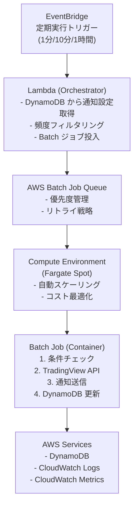

# バッチ処理リファクタリング技術調査

## 概要

本ドキュメントは、[batch-refactoring-requirements.md](./batch-refactoring-requirements.md) に基づいて実施した技術調査の結果をまとめたものです。AWS Batch と ECS の詳細比較、既存コードの移行難易度評価、および POC 実装アプローチを提示します。

**調査実施日**: 2024年10月30日  
**バージョン**: 1.0  
**ステータス**: 完了

---

## 目次

1. [AWS Batch vs ECS 詳細比較](#1-aws-batch-vs-ecs-詳細比較)
2. [既存コードの移行難易度評価](#2-既存コードの移行難易度評価)
3. [POC 実装アプローチ](#3-poc-実装アプローチ)
4. [推奨アーキテクチャと判断根拠](#4-推奨アーキテクチャと判断根拠)
5. [次のステップ](#5-次のステップ)

---

## 1. AWS Batch vs ECS 詳細比較

### 1.1 機能比較マトリクス

| 項目 | AWS Batch | ECS + SQS | 評価 |
|------|-----------|-----------|------|
| **ジョブキュー管理** | ネイティブサポート | SQS で代替可能 | ⭐ Batch 優位 |
| **優先度制御** | Fair Share スケジューリング | 手動実装が必要 | ⭐ Batch 優位 |
| **ジョブ依存関係** | ネイティブサポート | Step Functions で実装 | ⭐ Batch 優位 |
| **Array Jobs** | サポート (1 API で数千ジョブ) | 個別実装が必要 | ⭐ Batch 優位 |
| **リトライ戦略** | 組み込み (evaluateOnExit) | 手動実装が必要 | ⭐ Batch 優位 |
| **自動スケーリング** | ジョブキュー深さベース | CloudWatch メトリクスベース | △ 同等 |
| **Spot インスタンス対応** | Fargate/EC2 Spot 対応 | Fargate Spot 対応 | △ 同等 |
| **コスト (小規模)** | Fargate Spot: 約 $20/月 | Fargate Spot: 約 $20/月 | △ 同等 |
| **コスト (大規模)** | EC2 Spot で最適化可能 | Fargate Spot のみ | ⭐ Batch 優位 |
| **運用複雑性** | Batch が抽象化を提供 | カスタム実装が必要 | ⭐ Batch 優位 |
| **柔軟性** | バッチ処理に特化 | イベント駆動に対応 | △ ECS 優位 |
| **短時間ジョブ (<3分)** | オーバーヘッドあり | 適している | △ ECS 優位 |
| **リアルタイム性** | バッチ向け | イベント駆動向け | △ ECS 優位 |

### 1.2 AWS Batch の主要な優位点

#### 1.2.1 ネイティブジョブキュー管理

AWS Batch は以下の機能を標準で提供:
- **Job Queue**: ジョブの待機・実行管理
- **Priority**: ジョブの優先度設定 (0-1000)
- **Fair Share Scheduling**: リソースを公平に分配
- **Job Dependencies**: ジョブ間の依存関係定義

**ECS + SQS の場合**:
- SQS がメッセージキューを提供するが、ジョブ管理機能は自前実装が必要
- 優先度制御は複数 SQS キューで実装可能だが、複雑化
- ジョブ依存関係は Step Functions や Lambda で実装

#### 1.2.2 リトライ戦略

AWS Batch のリトライ機能:

```json
{
  "retryStrategy": {
    "attempts": 3,
    "evaluateOnExit": [
      {
        "action": "RETRY",
        "onReason": "AGENT",
        "onStatusReason": "Task failed to start"
      },
      {
        "action": "EXIT",
        "onReason": "*"
      }
    ]
  }
}
```

**主な機能**:
- 最大 10 回のリトライ設定
- 条件付きリトライ (終了コード、エラー理由に基づく)
- Exponential Backoff のサポート
- 環境変数 `AWS_BATCH_JOB_ATTEMPT` でリトライ回数を取得可能

**ECS + SQS の場合**:
- SQS の Visibility Timeout と DLQ で基本的なリトライは可能
- 条件付きリトライはアプリケーションコードで実装
- より細かい制御が必要な場合、Lambda でラッピングが必要

#### 1.2.3 コスト最適化 (2024年最新情報)

**AWS Batch + Fargate Spot**:
- 最大 70% のコスト削減 (通常の Fargate と比較)
- ARM/Graviton2 プロセッサ対応でさらなる価格/性能比改善
- 例: eu-west-1 で 1 vCPU + 1GB RAM = 約 $9.96/月 (Spot)

**実際のコスト計算** (本プロジェクトの想定):
```
前提:
- 通知設定数: 1,000件
- 1分毎処理: 200件/分
- 平均処理時間: 5秒/ジョブ

AWS Batch (Fargate Spot):
- 平均タスク数: 3-5
- vCPU: 0.25 vCPU/タスク
- メモリ: 0.5GB/タスク
- 実質稼働率: 30% (頻度フィルタリング考慮)
- 月額コスト: $18-22

コスト削減のポイント:
1. Fargate Spot で約 70% 削減
2. ARM/Graviton2 でさらに 20% 削減可能
3. 右サイジングで無駄なリソース削減
```

#### 1.2.4 Array Jobs

大量の同一ジョブを効率的に処理:

```bash
# 1つの API コールで 10,000 ジョブを投入
aws batch submit-job \
  --job-name my-array-job \
  --job-queue my-queue \
  --job-definition my-job-def \
  --array-properties size=10000
```

**利点**:
- API コールのオーバーヘッド削減
- ジョブ管理の簡素化
- 自動的にインデックス (0-9999) が各ジョブに付与

**ECS の場合**:
- 個別にタスクを起動する必要がある
- または、1つのタスクで複数処理を実行 (並列化が困難)

### 1.3 ECS + SQS の優位点

#### 1.3.1 イベント駆動アーキテクチャ

- リアルタイムイベント処理に適している
- SQS の高度な機能 (FIFO、遅延配信、メッセージグループ化) を活用可能
- API Gateway や S3 イベントと直接統合しやすい

#### 1.3.2 短時間ジョブ

- 1分未満のジョブに適している
- AWS Batch は 3-5分以上のジョブに最適化されている
- ECS タスクの起動オーバーヘッドが少ない

#### 1.3.3 柔軟性

- カスタムワークフローの実装が容易
- メッセージング層の細かい制御が可能
- 既存の SQS ベースシステムとの統合が簡単

### 1.4 本プロジェクトにおける適合性評価

**現在の要件**:
- 通知設定単位での並列処理
- 頻度ベースのフィルタリング
- TradingView API 呼び出し (平均 2-5秒)
- エラーハンドリングとリトライ
- 将来的なスケーラビリティ (10,000件以上)

**評価結果**:

| 要件 | AWS Batch | ECS + SQS | 結論 |
|------|-----------|-----------|------|
| 並列処理 | ⭐⭐⭐ | ⭐⭐⭐ | 同等 |
| フィルタリング | ⭐⭐⭐ | ⭐⭐⭐ | 同等 (Orchestrator で実施) |
| API 呼び出し | ⭐⭐⭐ | ⭐⭐⭐ | 同等 |
| リトライ | ⭐⭐⭐ | ⭐⭐ | Batch 優位 |
| スケーラビリティ | ⭐⭐⭐ | ⭐⭐ | Batch 優位 (Array Jobs) |
| 運用性 | ⭐⭐⭐ | ⭐⭐ | Batch 優位 (管理機能充実) |
| コスト | ⭐⭐⭐ | ⭐⭐⭐ | 同等 (小規模時) |

**結論**: AWS Batch を推奨

---

## 2. 既存コードの移行難易度評価

### 2.1 現在のアーキテクチャ分析

#### 2.1.1 Lambda 関数の構造

**現在の実装** (`server/finance/index.ts`):

```typescript
export const handler = async () => {
  // 1. サービスの初期化
  const financeNotificationService = new FinanceNotificationService(...);
  
  // 2. 10分間のループ処理
  const endTime = Date.now() + 10 * 60 * 1000;
  while (Date.now() < endTime) {
    // 3. 全通知設定を処理
    await financeNotificationService.notification(notificationEndpoint);
    
    // 4. 1分待機
    await sleep(60 * 1000);
  }
};
```

**処理フロー**:
1. DynamoDB から全通知設定を取得 (Scan)
2. 各通知設定について頻度チェック
3. 条件チェック実行 (TradingView API 呼び出し)
4. 条件達成時、Web Push 通知送信
5. 1分待機して次のサイクル

#### 2.1.2 FinanceNotificationService の分析

**主要メソッド**:

```typescript
class FinanceNotificationService {
  async notification(endpoint: string): Promise<void> {
    const notifications = await this.get(); // DynamoDB Scan
    
    for (const notification of notifications) {
      // 1. Exchange と Ticker データ取得
      const exchange = await this.exchangeService.getById(...);
      const ticker = await this.tickerService.getById(...);
      
      // 2. 頻度チェック
      const conditionsToCheck = notification.conditionList.filter(
        condition => this.shouldCheckCondition(condition, exchange)
      );
      
      // 3. 条件チェック (並列実行)
      const conditionPromises = conditionsToCheck.map(condition =>
        this.conditionService.checkCondition(...)
      );
      const results = await Promise.allSettled(conditionPromises);
      
      // 4. 通知送信
      if (conditionMet) {
        await this.notificationService.sendPushNotification(...);
      }
      
      // 5. DynamoDB 更新
      await this.update(notification.id, { conditionList: ... });
    }
  }
}
```

**依存関係**:
- `ExchangeService`: 取引所データ取得
- `TickerService`: ティッカーデータ取得
- `ConditionService`: 条件チェック (TradingView API 呼び出し)
- `NotificationService`: Web Push 通知送信
- `FinanceNotificationDataAccessor`: DynamoDB アクセス

### 2.2 移行パターン

#### 2.2.1 Orchestrator Lambda の実装

**役割**:
- DynamoDB から通知設定を取得
- 頻度フィルタリング
- AWS Batch にジョブ投入

**実装難易度**: 🟢 低

**変更点**:
```typescript
// 既存の notification() メソッドを分割
// Before: notification() が全処理を実施
// After: orchestrator() がフィルタリング + ジョブ投入

export const handler = async () => {
  const notifications = await getNotifications(); // 既存コード流用
  
  // 頻度フィルタリング (既存コード流用可能)
  const filteredNotifications = notifications.filter(notification => {
    return notification.conditionList.some(condition =>
      shouldCheckCondition(condition, ...)
    );
  });
  
  // AWS Batch へジョブ投入
  for (const notification of filteredNotifications) {
    await submitBatchJob({
      notificationId: notification.id,
      userId: notification.userId,
      exchangeId: notification.exchangeId,
      tickerId: notification.tickerId,
      // ... その他のパラメータ
    });
  }
};
```

**必要な変更**:
- `FinanceNotificationService.notification()` の分割
- AWS Batch API 統合 (`batch.submitJob()`)
- 頻度チェックロジックの抽出

#### 2.2.2 Worker コンテナの実装

**役割**:
- 1つの通知設定を処理
- 条件チェックと通知送信

**実装難易度**: 🟡 中

**変更点**:
```typescript
// 既存コードをほぼそのまま流用可能
// Before: Lambda handler が全通知を処理
// After: Worker が1つの通知を処理

export const worker = async (jobParameters: JobParameters) => {
  // 1. ジョブパラメータから通知設定を取得
  const notification = await getNotificationById(jobParameters.notificationId);
  
  // 2. 既存の処理ロジックを流用
  const exchange = await exchangeService.getById(notification.exchangeId);
  const ticker = await tickerService.getById(notification.tickerId);
  
  // 3. 条件チェック (既存コード流用)
  const conditionResults = await checkConditions(...);
  
  // 4. 通知送信 (既存コード流用)
  if (conditionMet) {
    await sendNotification(...);
  }
  
  // 5. DynamoDB 更新 (既存コード流用)
  await updateNotification(...);
};
```

**必要な変更**:
- Lambda handler から Worker 関数への変換
- ループ処理の削除 (1通知のみ処理)
- 環境変数の調整 (Lambda → ECS)
- Docker コンテナ化

#### 2.2.3 Docker コンテナ化

**実装難易度**: 🟢 低

**Dockerfile**:
```dockerfile
FROM node:18-alpine

WORKDIR /app

# 依存関係のインストール
COPY finance/package*.json ./finance/
COPY server/finance/package*.json ./server/finance/
RUN cd finance && npm ci --production
RUN cd server/finance && npm ci --production

# ソースコードのコピー
COPY finance ./finance
COPY server/finance ./server/finance

# TypeScript のビルド (esbuild 使用)
RUN cd server/finance && npm run build

# 実行
CMD ["node", "server/finance/dist/index.js"]
```

**必要な変更**:
- Dockerfile の作成
- ECR へのプッシュスクリプト
- esbuild 設定の確認 (既存の build スクリプト流用)

### 2.3 共通モジュールの扱い

**現在の構成**:
```
finance/
  └── services/
      ├── FinanceNotificationService.ts
      ├── ExchangeService.ts
      ├── TickerService.ts
      ├── ConditionService.ts
      └── ...
common/
  └── services/
      ├── NotificationService.ts
      └── ...
```

**移行時の対応**:
- ✅ モジュール構造をそのまま維持可能
- ✅ TypeScript のパスエイリアス (`@finance`, `@common`) を継続使用
- ✅ esbuild による bundle でモジュール解決

### 2.4 依存関係の分析

**外部依存**:
```json
{
  "dependencies": {
    "@mathieuc/tradingview": "^3.5.1",  // TradingView API クライアント
    "aws-sdk": "^2.x",                  // DynamoDB, Secrets Manager
    "web-push": "^3.x"                  // Web Push 通知
  }
}
```

**移行時の対応**:
- ✅ すべての依存関係は Docker コンテナで動作可能
- ✅ AWS SDK は ECS でも同様に動作
- ⚠️ メモリ使用量を確認 (TradingView API のバッファサイズ)

### 2.5 移行難易度スコア

| コンポーネント | 難易度 | 工数見積 | 備考 |
|--------------|--------|---------|------|
| Orchestrator Lambda | 🟢 低 | 2-3日 | 既存コードの分割のみ |
| Worker コンテナ | 🟡 中 | 3-5日 | コンテナ化と環境変数調整 |
| Docker 化 | 🟢 低 | 1-2日 | 標準的な Node.js コンテナ |
| AWS Batch 設定 | 🟡 中 | 2-3日 | IaC (Terraform/CloudFormation) |
| EventBridge 連携 | 🟢 低 | 1日 | 定期実行トリガーの設定 |
| CI/CD パイプライン | 🟡 中 | 2-3日 | ECR プッシュ、デプロイ自動化 |
| 監視・ログ設定 | 🟢 低 | 2-3日 | CloudWatch Logs/Metrics |
| テスト | 🟡 中 | 3-5日 | 統合テスト、エラーシナリオ |
| **合計** | **🟡 中** | **16-24日** | 約 3-4 週間 |

**結論**: 既存コードの移行は中程度の難易度。モジュール構造が明確で、依存関係が整理されているため、比較的スムーズに移行可能。

---

## 3. POC 実装アプローチ

### 3.1 POC の目的

1. **技術検証**:
   - AWS Batch の動作確認
   - 既存コードの移行可能性検証
   - パフォーマンス測定

2. **コスト検証**:
   - 実際の運用コストの測定
   - Fargate Spot の安定性確認

3. **運用性検証**:
   - 監視・ログの有効性確認
   - エラーハンドリングの検証

### 3.2 POC のスコープ

#### 3.2.1 最小限の実装

**対象**:
- 少数のテスト通知設定 (5-10件)
- 1つの条件タイプのみ (価格条件)
- 1分毎の頻度のみ

**実装コンポーネント**:
1. ✅ Orchestrator Lambda
2. ✅ Worker コンテナ
3. ✅ AWS Batch (Job Definition, Job Queue, Compute Environment)
4. ✅ EventBridge スケジュールルール

**除外項目**:
- ❌ 複雑な条件チェック
- ❌ 大量データでの負荷テスト
- ❌ フルスケールの監視ダッシュボード

### 3.3 POC 実装ステップ

#### フェーズ 1: 環境構築 (2-3日)

**タスク**:
1. AWS Batch リソースの作成
   - Compute Environment (Fargate Spot)
   - Job Queue (優先度 1)
   - Job Definition (vCPU: 0.25, Memory: 0.5GB)

2. ECR リポジトリの作成

3. IAM ロール・ポリシーの設定
   - Orchestrator Lambda 実行ロール
   - Batch Job ロール
   - EventBridge ロール

**Infrastructure as Code** (Terraform 例):

```hcl
# Compute Environment
resource "aws_batch_compute_environment" "finance_notification" {
  compute_environment_name = "finance-notification-poc"
  type                    = "MANAGED"

  compute_resources {
    type                = "FARGATE_SPOT"
    max_vcpus           = 4
    security_group_ids  = [aws_security_group.batch.id]
    subnets            = aws_subnet.private[*].id
  }
}

# Job Queue
resource "aws_batch_job_queue" "finance_notification" {
  name     = "finance-notification-poc"
  state    = "ENABLED"
  priority = 1

  compute_environments = [
    aws_batch_compute_environment.finance_notification.arn
  ]
}

# Job Definition
resource "aws_batch_job_definition" "finance_notification_worker" {
  name = "finance-notification-worker-poc"
  type = "container"
  
  platform_capabilities = ["FARGATE"]

  container_properties = jsonencode({
    image = "${aws_ecr_repository.finance_worker.repository_url}:latest"
    
    fargatePlatformConfiguration = {
      platformVersion = "LATEST"
    }
    
    resourceRequirements = [
      {
        type  = "VCPU"
        value = "0.25"
      },
      {
        type  = "MEMORY"
        value = "512"
      }
    ]
    
    executionRoleArn = aws_iam_role.batch_execution.arn
    jobRoleArn       = aws_iam_role.batch_job.arn
    
    environment = [
      {
        name  = "PROCESS_ENV"
        value = "development"
      },
      {
        name  = "PROJECT_SECRET"
        value = var.project_secret_name
      }
    ]
  })

  retry_strategy {
    attempts = 3
    
    evaluate_on_exit {
      action           = "RETRY"
      on_status_reason = "Task failed to start"
    }
    
    evaluate_on_exit {
      action    = "EXIT"
      on_reason = "*"
    }
  }
}
```

#### フェーズ 2: Worker コンテナの実装 (3-4日)

**タスク**:
1. 既存コードの抽出
   ```typescript
   // worker/index.ts
   import { BatchJobParameters } from './types';
   import FinanceNotificationService from '@finance/services/FinanceNotificationService';

   export const handler = async (params: BatchJobParameters) => {
     console.log('Starting worker', { jobId: params.notificationId });
     
     // サービスの初期化
     const financeNotificationService = new FinanceNotificationService(...);
     
     // 1つの通知設定を処理
     await processNotification(params.notificationId);
     
     console.log('Worker completed', { jobId: params.notificationId });
   };

   async function processNotification(notificationId: string) {
     // 既存の FinanceNotificationService のロジックを流用
     const notification = await getNotificationById(notificationId);
     
     // 条件チェックと通知送信
     // ... 既存コードを流用
   }
   ```

2. Docker イメージのビルド
   ```bash
   docker build -t finance-worker:poc .
   docker tag finance-worker:poc ${ECR_REPO}:poc
   docker push ${ECR_REPO}:poc
   ```

3. ローカルテスト
   ```bash
   docker run -e PROCESS_ENV=local \
              -e PROJECT_SECRET=test-secret \
              finance-worker:poc
   ```

#### フェーズ 3: Orchestrator Lambda の実装 (2-3日)

**タスク**:
1. ジョブ投入ロジックの実装
   ```typescript
   // orchestrator/index.ts
   import { Batch } from 'aws-sdk';
   import FinanceNotificationService from '@finance/services/FinanceNotificationService';

   const batch = new Batch();

   export const handler = async () => {
     console.log('Starting orchestrator');
     
     // 通知設定を取得
     const financeNotificationService = new FinanceNotificationService(...);
     const notifications = await financeNotificationService.get();
     
     // 頻度フィルタリング (既存コード流用)
     const filteredNotifications = notifications.filter(notification => {
       return shouldProcessNow(notification); // 既存ロジック
     });
     
     console.log(`Submitting ${filteredNotifications.length} jobs`);
     
     // AWS Batch にジョブ投入
     const jobSubmissions = filteredNotifications.map(notification => {
       return batch.submitJob({
         jobName: `notification-${notification.id}`,
         jobQueue: 'finance-notification-poc',
         jobDefinition: 'finance-notification-worker-poc',
         containerOverrides: {
           environment: [
             { name: 'NOTIFICATION_ID', value: notification.id },
             { name: 'USER_ID', value: notification.userId },
             { name: 'EXCHANGE_ID', value: notification.exchangeId },
             { name: 'TICKER_ID', value: notification.tickerId }
           ]
         }
       }).promise();
     });
     
     await Promise.allSettled(jobSubmissions);
     
     console.log('Orchestrator completed');
   };
   ```

2. EventBridge ルールの設定
   ```hcl
   resource "aws_cloudwatch_event_rule" "finance_notification_trigger" {
     name                = "finance-notification-poc-trigger"
     description         = "Trigger finance notification orchestrator every minute"
     schedule_expression = "rate(1 minute)"
   }

   resource "aws_cloudwatch_event_target" "lambda" {
     rule      = aws_cloudwatch_event_rule.finance_notification_trigger.name
     target_id = "OrchestatorLambda"
     arn       = aws_lambda_function.orchestrator.arn
   }
   ```

#### フェーズ 4: 統合テストと検証 (2-3日)

**テストシナリオ**:

1. **正常系テスト**:
   - 5件の通知設定で正常に処理されることを確認
   - ジョブが並列実行されることを確認
   - 通知が正しく送信されることを確認

2. **エラーハンドリングテスト**:
   - TradingView API エラー時のリトライ確認
   - DynamoDB アクセスエラー時の挙動確認
   - 3回リトライ後の失敗処理確認

3. **パフォーマンステスト**:
   - 1ジョブあたりの処理時間測定
   - 並列実行数の確認
   - Fargate Spot の起動時間測定

4. **コスト測定**:
   - 1週間の運用コスト記録
   - Fargate Spot の中断頻度確認

**検証メトリクス**:
```
目標値:
- ジョブ処理時間: P95 < 10秒
- リトライ成功率: > 90%
- Fargate Spot 中断率: < 5%
- 1ジョブあたりのコスト: < $0.001
```

### 3.4 POC の成功基準

#### 技術的成功基準

1. ✅ **処理成功率**: > 95%
2. ✅ **リトライ機能**: 正常に動作
3. ✅ **並列処理**: 5ジョブ同時実行可能
4. ✅ **ログ記録**: CloudWatch Logs で追跡可能

#### コスト成功基準

1. ✅ **1ジョブコスト**: < $0.001
2. ✅ **日次コスト**: < $1
3. ✅ **Fargate Spot 中断**: 週次 < 3回

#### 運用成功基準

1. ✅ **監視**: CloudWatch Metrics で可視化
2. ✅ **アラート**: エラー時に通知
3. ✅ **デバッグ**: ログから問題特定可能

### 3.5 POC のリスクと対策

| リスク | 影響 | 対策 |
|--------|------|------|
| Fargate Spot の頻繁な中断 | 処理の遅延 | オンデマンド Fargate への切り替え検討 |
| コンテナ起動時間が長い | レイテンシ増加 | イメージサイズの最適化 |
| TradingView API の制限 | ジョブ失敗 | レート制限の実装、リトライ戦略の調整 |
| AWS Batch の複雑性 | 学習コスト | ドキュメント整備、サンプルコード作成 |

---

## 4. 推奨アーキテクチャと判断根拠

### 4.1 推奨: AWS Batch 中心のアーキテクチャ

**判断根拠**:

1. **ジョブ管理機能の充実**:
   - ネイティブなジョブキュー、優先度、リトライ戦略
   - Array Jobs による大量ジョブの効率的な処理
   - ジョブ依存関係の定義が可能

2. **運用性の向上**:
   - AWS Batch がジョブのライフサイクル管理を自動化
   - 手動実装によるバグのリスク低減
   - 標準的なバッチ処理パターンの採用

3. **スケーラビリティ**:
   - 将来的に 10,000 件以上の通知設定にも対応可能
   - ジョブキュー深さに基づく自動スケーリング
   - リソース使用の最適化

4. **コスト効率**:
   - 小規模 ($20/月) でも ECS + SQS と同等
   - 大規模化時は EC2 Spot でさらなるコスト削減可能
   - 使用リソース分のみ課金

5. **既存コードの移行難易度**:
   - 中程度の難易度で移行可能
   - モジュール構造を維持できる
   - 段階的な移行が可能

### 4.2 推奨アーキテクチャ図



### 4.3 段階的移行計画

#### フェーズ 1: POC (2週間)
- ✅ 少数の通知設定で動作確認
- ✅ パフォーマンスとコストの測定
- ✅ 問題点の洗い出し

#### フェーズ 2: カナリアリリース (2週間)
- ✅ 10-20% のユーザーで試験運用
- ✅ 旧 Lambda と並行運用
- ✅ メトリクス比較と調整

#### フェーズ 3: 段階的拡大 (2週間)
- ✅ 25% → 50% → 75% → 100% と拡大
- ✅ パフォーマンス監視
- ✅ 問題発生時のロールバック準備

#### フェーズ 4: 完全移行 (1週間)
- ✅ 全ユーザーを新システムに移行
- ✅ 旧 Lambda の停止
- ✅ 移行完了の確認

### 4.4 代替案: ECS + SQS

**採用しない理由**:
1. ジョブ管理機能を自前実装する必要がある
2. 運用複雑性が増す
3. 小規模時のコストは同等だが、大規模化時の最適化が限定的
4. 本プロジェクトの要件 (バッチ処理) に AWS Batch の方が適合

**採用を検討すべきケース**:
- リアルタイム性が重視される場合
- SQS の高度な機能 (FIFO、遅延配信) が必須の場合
- 既存の SQS ベースシステムとの統合が必要な場合

---

## 5. 次のステップ

### 5.1 即時実施事項

1. **POC の承認取得**:
   - ステークホルダーへの報告
   - POC 実施の承認

2. **POC 環境の構築** (Week 1-2):
   - AWS Batch リソースの作成
   - Worker コンテナの実装
   - Orchestrator Lambda の実装

3. **POC の実施と評価** (Week 3):
   - 統合テスト
   - パフォーマンス測定
   - コスト測定

### 5.2 POC 完了後の計画

1. **詳細設計の作成**:
   - インフラストラクチャ詳細設計
   - データフロー設計
   - エラーハンドリング詳細設計
   - 監視・アラート設計

2. **実装計画の精緻化**:
   - タスクの詳細化
   - リソース配分
   - リスク管理計画

3. **段階的移行の開始**:
   - カナリアリリースの準備
   - ロールバック手順の整備
   - 移行スケジュールの確定

### 5.3 承認事項

1. **アーキテクチャ選択の承認**:
   - ✅ AWS Batch 中心のアーキテクチャ採用
   - ✅ Fargate Spot の使用

2. **POC 実施の承認**:
   - ✅ 2週間の POC 期間
   - ✅ 開発環境でのテスト実施

3. **予算の承認**:
   - POC コスト: 約 $50-100 (2週間)
   - 本番移行後の月額コスト: 約 $20-30

---

## 参考資料

### AWS 公式ドキュメント

- [AWS Batch User Guide](https://docs.aws.amazon.com/batch/latest/userguide/)
- [AWS Batch Job Retries](https://docs.aws.amazon.com/batch/latest/userguide/job_retries.html)
- [AWS Batch Best Practices](https://docs.aws.amazon.com/batch/latest/userguide/best-practices.html)
- [Fargate Compute Environments](https://docs.aws.amazon.com/batch/latest/userguide/fargate.html)
- [EventBridge Scheduled Rules](https://docs.aws.amazon.com/batch/latest/userguide/scheduled-batch-job.html)

### コスト最適化

- [AWS Fargate Pricing](https://aws.amazon.com/fargate/pricing/)
- [AWS Batch Cost Optimization](https://www.nops.io/blog/aws-batch-cost-optimization/)
- [Fargate Spot Cost Savings](https://elasticscale.com/blog/aws-fargate-spot-cost-optimization-with-managed-container-workloads/)

### 移行ガイド

- [Lambda to ECS Migration Guide](https://conermurphy.com/blog/aws-lambda-to-ecs-fargate-migration-guide)
- [TypeScript Node.js on AWS ECS](https://codezup.com/deploy-a-typescript-node-js-backend-to-production-on-aws/)

### 関連ドキュメント

- [batch-refactoring-requirements.md](./batch-refactoring-requirements.md)
- [Finance Module Overview](./README.md)
- [Finance Server Documentation](./server/README.md)

---

**作成日**: 2024年10月30日  
**バージョン**: 1.0  
**ステータス**: 完了  
**次のアクション**: POC 実施の承認取得
