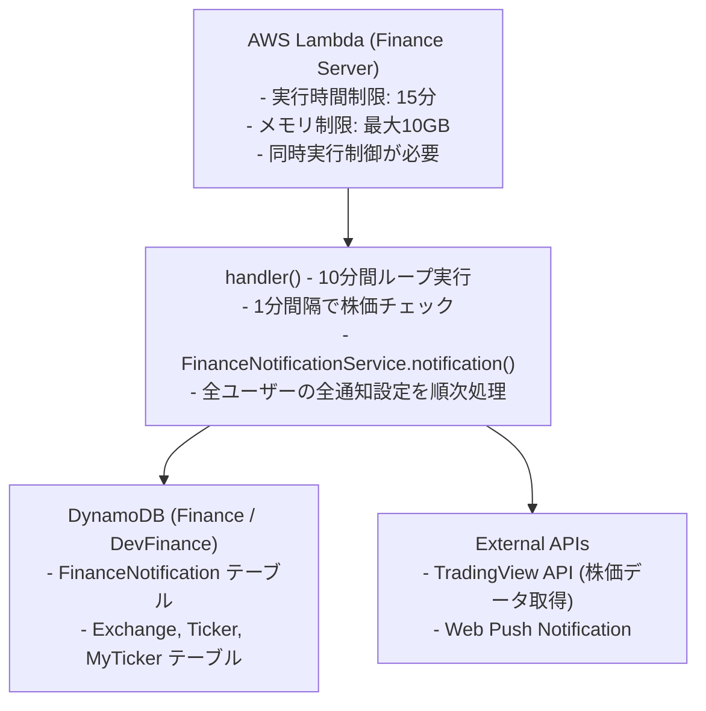
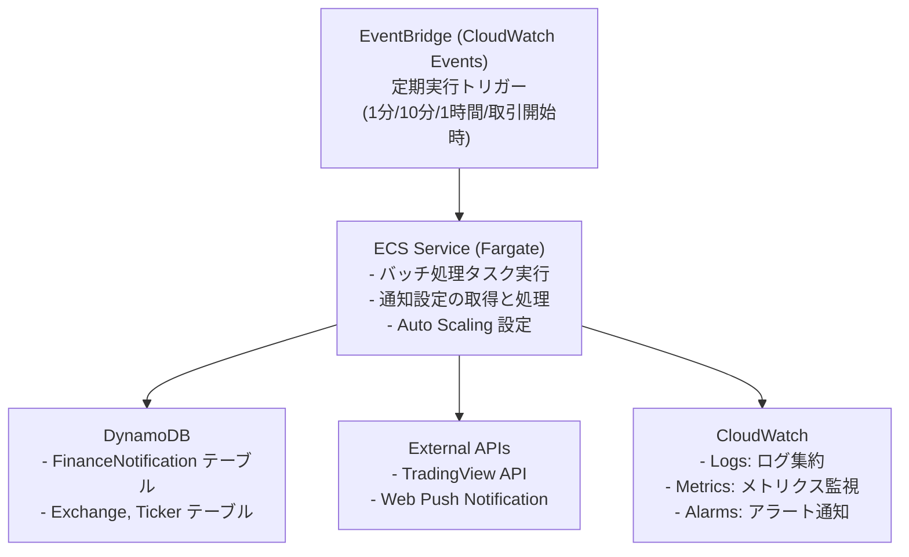

# バッチ処理リファクタリング要件定義

## 概要

現行のバッチ処理システムをより堅牢でスケーラブルなアーキテクチャに移行するための要件定義書です。AWS Lambda の制約（実行時間制限）を克服し、EventBridge と ECS を活用したシンプルで運用しやすい構成を実現します。

## 現状分析

### 現在のアーキテクチャ



### 現状の課題

#### 1. Lambda の実行時間制限

- **問題**: Lambda の最大実行時間は15分
- **影響**: 
    - ユーザー数や通知設定数が増加すると処理が完了しない可能性がある
    - 現在は10分間で処理を完了させる設計だが、将来的にスケールしにくい
    - 処理途中で打ち切られるリスクがある

#### 2. スケーラビリティの制約

- **問題**: モノリシックな処理フロー
- **影響**:
    - 全ユーザーの通知設定を1つの Lambda で順次処理
    - 特定の処理が遅延すると全体に影響
    - 処理の並列化が困難

#### 3. 運用性の課題

- **問題**: 処理の可視化とエラーハンドリングが限定的
- **影響**:
    - どの処理で時間がかかっているか把握しにくい
    - 一時的なエラーに対する再試行が不十分
    - デバッグに時間がかかる

### 現在のバッチ処理フロー

```typescript
// server/finance/index.ts の主要処理フロー
export const handler = async () => {
  // 1. 初期化
  const financeNotificationService = new FinanceNotificationService(...);
  const notificationEndpoint = await getEndpoint();
  
  // 2. 10分間のループ処理
  const endTime = Date.now() + 10 * 60 * 1000;
  while (Date.now() < endTime) {
    // 3. 全通知設定を処理
    await financeNotificationService.notification(notificationEndpoint);
    
    // 4. 1分待機
    await sleep(60 * 1000);
  }
};
```

**処理内容:**
1. DynamoDB から全通知設定を取得 (Scan)
2. 各通知設定について:
    - 頻度チェック (1分毎/10分毎/1時間毎/取引開始時)
    - 該当する場合、条件チェック実行
    - TradingView API で株価データ取得
    - 条件評価 (価格条件、パターン条件など)
    - 条件達成時、Web Push 通知送信
3. 全設定の処理完了後、次のサイクルまで待機

## 目標アーキテクチャ

### 推奨アーキテクチャ: EventBridge + ECS

現在の要件を再評価した結果、**EventBridge による定期実行 + ECS タスク**の構成が最適であると判断しました。

#### 要件の再評価

1. **処理の重さ**: 
   - 実際の処理は TradingView API 呼び出しと条件チェックが主体
   - 1通知あたり数秒程度で完了する軽量な処理
   - 大量のデータ処理やバッチ計算は不要

2. **実行時間の制約**:
   - Lambda の15分制限は厳しいが、ECS タスクなら制限なし
   - 通知設定が増えても、十分な時間で処理可能

3. **システムの複雑性**:
   - AWS Batch は大規模バッチ処理向けの機能が豊富
   - しかし本要件にはオーバースペックで、システムが複雑化
   - EventBridge + ECS の方がシンプルで理解しやすい

#### 推奨アーキテクチャ図



#### アーキテクチャの特徴

**EventBridge + ECS を選択する理由:**

1. **シンプルな構成**
    - EventBridge で定期実行を設定
    - ECS タスクで処理を実行
    - 追加のジョブ管理レイヤーが不要

2. **十分なスケーラビリティ**
    - 通知設定数の増加に対応可能
    - ECS タスクの Auto Scaling で処理能力を調整
    - 将来的な拡張も容易

3. **実行時間制限なし**
    - Lambda の15分制限から解放
    - 処理が長引いても問題なし
    - 安定した処理実行

4. **コスト効率**
    - Fargate Spot 利用で約70%コスト削減
    - 必要な時だけリソース起動
    - Lambda と同等かそれ以下のコスト

5. **運用性の向上**
    - 既存の Lambda コードを流用しやすい
    - CloudWatch による統一的な監視
    - トラブルシューティングが容易

### 処理フロー

#### 定期実行の仕組み

EventBridge (CloudWatch Events) が、以下の頻度で ECS タスクをトリガーします:

- **1分毎**: 頻繁な監視が必要な通知設定を処理
- **10分毎**: 中頻度の通知設定を処理  
- **1時間毎**: 低頻度の通知設定を処理
- **取引開始時**: 取引所の開場時に処理

#### ECS タスクの処理内容

```typescript
// ECS タスクの主要処理フロー
export const handler = async () => {
  // 1. 初期化
  const financeNotificationService = new FinanceNotificationService(...);
  const notificationEndpoint = await getEndpoint();
  
  // 2. 通知設定を取得
  const notifications = await financeNotificationService.get();
  
  // 3. 頻度に基づくフィルタリング
  const filteredNotifications = filterByFrequency(notifications, getCurrentFrequency());
  
  // 4. 各通知設定を処理（既存ロジックを流用）
  for (const notification of filteredNotifications) {
    // 条件チェック
    const shouldNotify = await checkConditions(notification);
    
    // 通知送信
    if (shouldNotify) {
      await sendNotification(notification, notificationEndpoint);
    }
  }
};
```

**処理の特徴:**
- 既存の Lambda コードをほぼそのまま流用可能
- 実行時間制限がないため、処理量が増えても安定動作
- CloudWatch Logs で処理状況を追跡可能

## 詳細要件

### 機能要件

#### FR-1: 定期実行とスケジューリング

- **要件**: EventBridge により定期的にバッチ処理を実行する
- **詳細**:
    - 1分毎、10分毎、1時間毎、取引開始時の4つのスケジュール
    - 各スケジュールで ECS タスクを起動
    - 頻度に応じた通知設定のフィルタリング
- **受入基準**:
    - 各頻度で正確にタスクが起動される
    - スケジュール設定の変更が容易

#### FR-2: 実行時間制限の解消

- **要件**: Lambda の15分制限を超えて処理を実行できる
- **詳細**:
    - ECS タスクは実行時間制限なし
    - 通知設定数が増加しても安定した処理
    - タイムアウトによる処理中断の回避
- **受入基準**:
    - 1,000件の通知設定を問題なく処理完了
    - 将来的に10,000件以上にも対応可能

#### FR-3: 条件チェックと通知送信

- **要件**: 既存の条件チェックロジックを維持する
- **詳細**:
    - FinanceNotificationService の既存ロジックを流用
    - 価格条件、パターン条件のチェック
    - 条件達成時の Web Push 通知送信
    - 最終通知時刻の更新
- **受入基準**:
    - 既存機能と同等の条件チェックが動作
    - 通知送信成功率 > 99%

#### FR-4: エラーハンドリング

- **要件**: 一時的なエラーに対して適切に対処する
- **詳細**:
    - TradingView API エラー時のリトライ処理
    - エラー発生時のログ記録
    - CloudWatch Alarms によるエラー通知
- **受入基準**:
    - API の一時的エラーで処理が継続される
    - エラー発生時に適切なアラートが通知される

#### FR-5: ログとモニタリング

- **要件**: 処理の可視化とデバッグを容易にする
- **詳細**:
    - CloudWatch Logs への構造化ログ出力
    - 各処理のレイテンシ計測
    - エラー発生時の詳細なコンテキスト記録
    - CloudWatch Metrics によるメトリクス収集
- **受入基準**:
    - CloudWatch Insights でログ検索可能
    - メトリクスダッシュボードで処理状況を確認可能

### 非機能要件

#### NFR-1: スケーラビリティ

- **目標**: 通知設定数の増加に対応できる
- **指標**:
    - 1,000件の通知設定を15分以内に処理完了
    - 10,000件の通知設定にも対応可能な設計
- **スケーリング戦略**:
    - ECS タスクの CPU・メモリ設定で処理能力を調整
    - 必要に応じて複数タスクの並列実行も検討可能

#### NFR-2: 可用性

- **目標**: 99.9% のアップタイム
- **指標**:
    - サービス停止時間 < 43分/月
    - 通知処理の成功率 > 99%
- **戦略**:
    - Fargate によるマルチ AZ 配置
    - ECS タスクのヘルスチェック
    - CloudWatch Alarms による異常検知

#### NFR-3: パフォーマンス

- **目標**: 効率的な通知処理
- **指標**:
    - 1,000件の通知設定を15分以内に処理
    - TradingView API 呼び出し時間 < 3秒 (P95)
    - 通知送信時間 < 1秒 (P95)
- **最適化**:
    - 既存の処理ロジックを流用
    - 必要に応じて API 呼び出しの並列化

#### NFR-4: コスト効率

- **目標**: 現行 Lambda コストと同等または削減
- **指標**:
    - 月額コスト < Lambda の 1.2倍
    - アイドル時のコスト最小化
- **戦略**:
    - Fargate Spot の活用 (約70% コスト削減)
    - 適切な CPU/メモリ割り当て (0.25 vCPU, 512MB から開始)
    - 処理時間の最小化

#### NFR-5: 運用性

- **目標**: 問題の早期検知と迅速な対応
- **指標**:
    - 障害検知 < 5分
    - エラー発生時のアラート通知
    - CloudWatch ダッシュボードでの可視化
- **ツール**:
    - CloudWatch Alarms
    - CloudWatch Dashboards
    - SNS 通知

### セキュリティ要件

#### SEC-1: 認証と認可

- **要件**: AWS サービス間の安全な通信
- **詳細**:
    - IAM ロールベースのアクセス制御
    - 最小権限の原則
    - サービス間の VPC エンドポイント使用

#### SEC-2: データ保護

- **要件**: 機密情報の安全な管理
- **詳細**:
    - Secrets Manager による認証情報管理
    - SQS メッセージの暗号化
    - CloudWatch Logs の暗号化

#### SEC-3: ネットワークセキュリティ

- **要件**: セキュアなネットワーク構成
- **詳細**:
    - AWS Batch ジョブの VPC 配置
    - セキュリティグループによるアクセス制限
    - NAT Gateway 経由の外部 API アクセス

## データモデル

### 環境変数

ECS タスクに渡す環境変数:

```json
{
  "PROCESS_ENV": "production",
  "PROJECT_SECRET": "finance-app-secrets",
  "EXECUTION_FREQUENCY": "MINUTE"
}
```

- `PROCESS_ENV`: 実行環境 (`local`, `development`, `production`)
- `PROJECT_SECRET`: AWS Secrets Manager のシークレット名
- `EXECUTION_FREQUENCY`: 実行頻度 (`MINUTE`, `TEN_MINUTES`, `HOUR`, `MARKET_OPEN`)

### DynamoDB スキーマ (既存維持)

**FinanceNotification テーブル:**
- PK: `userId#tickerId#conditionType` (例: `user123#AAPL-NYSE#SansenAkenomyojo`)
- Attributes:
    - `conditionType`: 条件タイプ
    - `frequency`: 通知頻度
    - `timeframe`: 時間枠
    - `targetPrice`: 目標価格
    - `lastNotifiedAt`: 最終通知日時
    - `createdAt`, `updatedAt`

**既存スキーマをそのまま使用:**
- スキーマ変更は不要
- 既存の Lambda と同じデータモデルを利用
- 移行が容易

## 実装計画

### フェーズ1: 基盤構築 (1-2週間)

#### Week 1: インフラ構築と ECS タスク実装

**タスク:**
1. ECS 環境の構築
    - ECS クラスターの作成 (Fargate)
    - タスク定義の作成 (CPU: 0.25 vCPU, Memory: 512MB)
    - Fargate Spot の設定
2. Docker コンテナの作成
    - 既存 Lambda コードのコンテナ化
    - Dockerfile 作成
    - ECR リポジトリの作成とプッシュ
3. EventBridge 設定
    - スケジュールルールの作成 (1分/10分/1時間/取引開始時)
    - ECS タスク起動の設定
4. IAM ロール・ポリシー設定
    - ECS タスク実行ロール
    - ECS タスクロール (DynamoDB, Secrets Manager アクセス)

**成果物:**
- ECS インフラストラクチャ (Terraform/CloudFormation)
- Docker イメージ
- EventBridge スケジュール設定

#### Week 2: 統合テストと監視

**タスク:**
1. 統合テスト
    - エンドツーエンドテスト
    - 各頻度での動作確認
    - エラーシナリオテスト
2. 監視設定
    - CloudWatch Logs グループ作成
    - CloudWatch Alarms 設定
    - CloudWatch Dashboards 作成
3. ドキュメント作成
    - 運用手順書
    - トラブルシューティングガイド

**成果物:**
- テスト結果レポート
- 監視・アラート設定
- 運用ドキュメント

### フェーズ2: 段階的移行 (1-2週間)

#### Week 1: 並行運用開始

**タスク:**
1. 新旧システムの並行運用開始
2. 少数の通知設定で動作確認
3. メトリクス収集と分析
4. 問題の修正

#### Week 2: 完全移行

**タスク:**
1. 全通知設定を新システムに移行
2. 旧 Lambda の停止
3. 移行完了の確認

### フェーズ3: 最適化 (継続的)

**タスク:**
1. パフォーマンスチューニング
2. コスト最適化
    - Fargate Spot の安定性確認
    - CPU/メモリ設定の最適化
3. 監視の強化
    - より詳細なメトリクス追加
    - アラート条件の調整

## モニタリング計画

### Key Performance Indicators (KPI)

#### 処理時間
- **メトリクス**: ECS タスク実行時間
- **目標**: < 15分 (1,000件の通知設定)
- **アラート**: > 20分

#### スループット
- **メトリクス**: 処理された通知設定数
- **目標**: > 1,000件/実行
- **アラート**: < 500件/実行

#### エラー率
- **メトリクス**: 失敗した処理 / 総処理数
- **目標**: < 1%
- **アラート**: > 5%

#### ECS タスク起動成功率
- **メトリクス**: 成功したタスク起動 / 総タスク起動試行
- **目標**: > 99%
- **アラート**: < 95%

### CloudWatch ダッシュボード

**メトリクス:**
1. ECS タスク
    - タスク起動回数
    - タスク実行時間
    - タスク失敗回数
    - CPU/メモリ使用率
2. カスタムメトリクス
    - 処理された通知設定数
    - 通知送信成功数
    - API 呼び出し時間
    - エラー発生数

### ログ戦略

**構造化ログ形式:**
```json
{
  "timestamp": "2024-10-29T23:00:00.000Z",
  "level": "INFO",
  "component": "finance-batch",
  "action": "process_notifications",
  "frequency": "MINUTE",
  "processed_count": 150,
  "success_count": 148,
  "error_count": 2,
  "duration_ms": 45000
}
```

**ログレベル:**
- **ERROR**: 処理失敗、例外発生
- **WARN**: リトライ、異常値検出
- **INFO**: タスク開始/完了、通知送信
- **DEBUG**: 詳細な処理フロー (開発時のみ)

## コスト見積もり

### 前提条件
- 通知設定数: 1,000件
- 1分毎の実行: 60回/時間 × 24時間 = 1,440回/日
- 10分毎の実行: 6回/時間 × 24時間 = 144回/日
- 1時間毎の実行: 24回/日
- タスク実行時間: 平均10分/回

### 現行コスト (Lambda)

**Lambda:**
- 実行時間: 10分間 × 6回/時間 = 60分/時間 = 1,440分/日
- メモリ: 512MB
- 料金: $0.0000133334/GB-秒
- 月額: 1,440分 × 30日 × 60秒 × 0.5GB × $0.0000133334 ≈ $34.56

**合計: 約 $35/月**

### 新アーキテクチャコスト (ECS Fargate)

#### ECS Fargate Spot (推奨)

**タスク実行コスト:**
- タスク数/日: 約1,608回 (1分毎 + 10分毎 + 1時間毎)
- タスク実行時間: 平均10分/回
- 総実行時間/日: 1,608回 × 10分 = 16,080分 ≈ 268時間/日
- 総実行時間/月: 268時間 × 30日 = 8,040時間/月

**Fargate Spot 料金 (東京リージョン):**
- vCPU: 0.25 vCPU × $0.01373/時間 (Spot) = $0.00343/時間
- Memory: 0.5GB × $0.00151/時間 (Spot) = $0.000755/時間
- 合計: $0.004185/時間

**月額コスト:**
- 8,040時間 × $0.004185 ≈ **$33.65**

#### コスト最適化の余地

**処理時間の短縮:**
- 実際の処理は数分で完了する可能性が高い
- 平均5分で完了した場合: **$16.82/月**

**Fargate 通常料金 (比較参考):**
- vCPU: 0.25 vCPU × $0.04656/時間 = $0.01164/時間
- Memory: 0.5GB × $0.00512/時間 = $0.00256/時間
- 合計: $0.0142/時間
- 月額: 8,040時間 × $0.0142 ≈ $114.17

### コスト比較

| 項目 | 現行 (Lambda) | ECS Fargate Spot | ECS Fargate (通常) |
|------|--------------|-----------------|-------------------|
| 基本料金 | $34.56 | $33.65 | $114.17 |
| **最適化後** | - | **$16-20** | - |

**結論:**

- **ECS Fargate Spot**: $33.65/月 (Lambda とほぼ同等)
- **最適化後**: $16-20/月 (Lambda より安価)
- **主な価値**: コストを維持しつつ、実行時間制限を解消し、シンプルな構成を実現

**注意点:**
- 上記は概算であり、実際のコストは使用量によって変動
- CloudWatch Logs/Metrics のコストは別途
- データ転送コストは微小のため省略

## リスクと対策

### リスク1: 移行時のダウンタイム

**リスクレベル**: 低

**影響:**
- 通知が一時的に停止する可能性

**対策:**
- 旧 Lambda と新 ECS タスクの並行運用
- 段階的な移行
- ロールバック手順の事前準備

### リスク2: コスト超過

**リスクレベル**: 低

**影響:**
- 予算オーバー

**対策:**
- CloudWatch Billing Alerts の設定
- Fargate Spot の活用
- タスク実行時間の監視と最適化

### リスク3: Fargate Spot の中断

**リスクレベル**: 低

**影響:**
- タスク実行中の中断
- 処理の一時的な遅延

**対策:**
- 処理のべき等性を確保
- 中断時の自動再実行
- 必要に応じて通常 Fargate への切り替え

### リスク4: 処理時間の増加

**リスクレベル**: 中

**影響:**
- 通知の遅延

**対策:**
- パフォーマンス監視
- タスクリソース (CPU/メモリ) の調整
- 処理ロジックの最適化

### リスク5: 外部 API の制限

**リスクレベル**: 中

**影響:**
- TradingView API のレート制限
- データ取得失敗

**対策:**
- レート制限を考慮した処理間隔
- エラー時のリトライロジック
- API レスポンスのキャッシング検討

## 成功基準

### 技術的成功基準

1. **実行時間制限の解消**
    - Lambda の15分制限に制約されない
    - 1,000件の通知設定を安定して処理完了

2. **可用性の維持**
    - 通知成功率 > 99%
    - システムアップタイム > 99.9%

3. **コスト最適化**
    - 月額コスト ≤ 現行の Lambda コスト
    - Fargate Spot 活用で更なるコスト削減

4. **シンプルな構成**
    - AWS Batch を使わずシンプルな構成を実現
    - 運用・保守が容易

### ビジネス的成功基準

1. **システムの信頼性向上**
    - 処理の安定性向上
    - エラーハンドリングの改善

2. **運用効率の向上**
    - デバッグ時間の短縮
    - 障害対応時間の削減

3. **将来への拡張性**
    - 通知設定数の増加に対応可能
    - 新機能追加が容易

## 次のステップ

### 即時実施事項

1. **要件定義の承認**
    - ステークホルダーへの報告
    - EventBridge + ECS アーキテクチャの承認

2. **詳細設計**
    - ECS タスク定義の詳細設計
    - EventBridge スケジュール設計
    - エラーハンドリング設計

3. **実装準備**
    - 開発環境のセットアップ
    - Docker コンテナの準備
    - IaC (Infrastructure as Code) の作成

### 承認事項

1. **アーキテクチャ選択の承認**
    - EventBridge + ECS での実装承認
    - AWS Batch を使用しない方針の承認

2. **予算承認**
    - 開発コスト
    - 運用コスト (月額 $20-35)

3. **スケジュール承認**
    - 実装期間: 1-2週間
    - 移行期間: 1-2週間

## 参考資料

### AWS ドキュメント

- [Amazon ECS Developer Guide](https://docs.aws.amazon.com/ecs/)
- [EventBridge Scheduled Rules](https://docs.aws.amazon.com/eventbridge/latest/userguide/eb-create-rule-schedule.html)
- [AWS Fargate Pricing](https://aws.amazon.com/fargate/pricing/)
- [ECS Task Definitions](https://docs.aws.amazon.com/AmazonECS/latest/developerguide/task_definitions.html)

### 関連ドキュメント

- **[TODO リスト](./todo.md)** - 実装タスク一覧
- [Finance Module Overview](./README.md)
- [Finance Server Documentation](./server/README.md)

### ベストプラクティス

- [AWS Well-Architected Framework](https://aws.amazon.com/architecture/well-architected/)
- [Container Best Practices](https://aws.amazon.com/blogs/containers/)
- [EventBridge Best Practices](https://docs.aws.amazon.com/eventbridge/latest/userguide/eb-best-practices.html)

---

**作成日**: 2024年10月29日  
**最終更新**: 2025年11月2日  
**バージョン**: 2.0  
**ステータス**: 要件見直し完了 - EventBridge + ECS アーキテクチャへ変更
